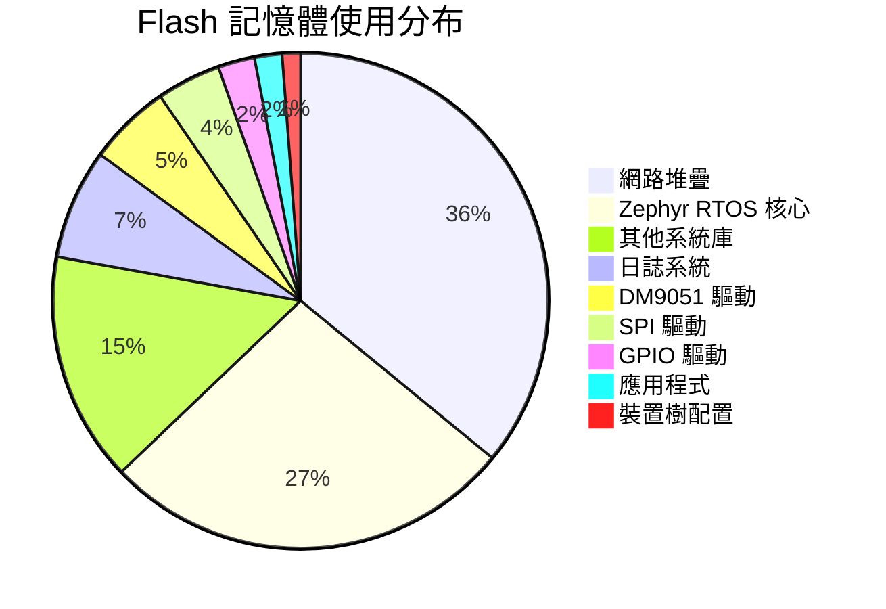
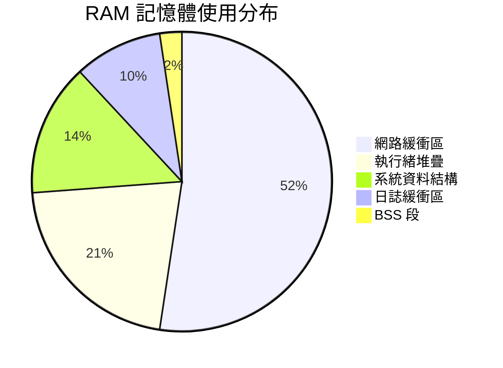

# nRF54L15 DHCPv4 Client 記憶體使用分析

本文件詳細分析 DHCPv4 Client 專案在 nRF54L15DK 開發板上的記憶體使用情況，包括 Flash 和 RAM 的使用分析、組成說明及優化建議。

## 📊 記憶體使用總覽

### 建置輸出

```
Memory region         Used Size  Region Size  %age Used
           FLASH:      171500 B      1428 KB     11.73%
             RAM:       42640 B       188 KB     22.15%
        IDT_LIST:          0 GB        32 KB      0.00%
```

**建置資訊：**
- **平台：** nRF54L15DK (nrf54l15dk/nrf54l15/cpuapp)
- **Zephyr 版本：** 4.1.99 (ncs-v3.1.0)
- **專案：** DHCPv4 Client with DM9051 Ethernet Driver
- **建置日期：** 2025-12-03

---

## 🔸 FLASH 記憶體分析

### 使用統計

| 項目 | 數值 | 說明 |
|------|------|------|
| **已使用** | 171,500 bytes (167.48 KB) | 實際程式碼和常數資料大小 |
| **總容量** | 1,462,272 bytes (1,428 KB) | nRF54L15 的 Flash 總容量 |
| **使用率** | **11.73%** | 非常充裕的使用率 |
| **剩餘空間** | 1,290,772 bytes (~1,260 KB) | 可用於未來功能擴展 |

### 使用狀態評估

✅ **優秀** - Flash 使用率低於 12%

**優點：**
- 有大量空間可用於功能擴展
- 可以添加更多網路協定（MQTT、CoAP、HTTP 等）
- 可以啟用更多除錯功能而不用擔心空間不足
- 支援 OTA（Over-The-Air）更新時有足夠的雙 bank 空間

**可擴展功能示例：**
- TLS/DTLS 加密（約需 40-60 KB）
- MQTT 客戶端（約需 20-30 KB）
- HTTP 客戶端（約需 15-25 KB）
- JSON 解析器（約需 10-15 KB）
- 檔案系統支援（約需 30-50 KB）

### Flash 記憶體組成分析

#### 詳細組成（總計 ~167 KB）



#### 1. 網路堆疊 (~60-70 KB)

**主要組件：**
- **IPv4 協定堆疊** (~20 KB)
  - IP 封包處理
  - 路由表管理
  - 分片和重組
  
- **DHCPv4 客戶端** (~8 KB)
  - DHCP 狀態機
  - 選項解析
  - 租約管理
  
- **ARP 協定** (~5 KB)
  - ARP 快取
  - 地址解析
  
- **UDP 協定** (~6 KB)
  - UDP 封包處理
  - 校驗和計算
  
- **Ethernet L2 層** (~8 KB)
  - 乙太網路幀處理
  - MAC 地址管理
  
- **網路緩衝區管理** (~10 KB)
  - 封包緩衝區分配
  - 記憶體池管理

#### 2. Zephyr RTOS 核心 (~40-50 KB)

**主要組件：**
- 排程器和執行緒管理 (~15 KB)
- 同步原語（semaphore、mutex、queue）(~8 KB)
- 記憶體管理 (~6 KB)
- 系統呼叫和中斷處理 (~10 KB)
- 時鐘和計時器 (~5 KB)

#### 3. DM9051 Ethernet 驅動 (~8-10 KB)

**功能包含：**
- SPI 通訊介面
- 裝置初始化和重置
- MAC 位址配置
- PHY 管理和連線檢測
- 封包傳送和接收
- 中斷處理
- 錯誤處理和恢復

#### 4. SPI 驅動 (~5-8 KB)

**功能包含：**
- nRF SPI 主控制器驅動
- DMA 支援
- 多裝置管理
- 時鐘配置

#### 5. 日誌系統 (~10-15 KB)

**功能包含：**
- UART 後端
- 日誌格式化
- 緩衝管理
- 多等級支援

#### 6. 應用程式碼 (~2-3 KB)

**包含：**
- [main.c](file:///c:/ncs/v3.1.0/zephyr/samples/net/dhcpv4_client/src/main.c) 中的邏輯
- DHCP 事件處理
- 網路狀態顯示

#### 7. 其他系統組件 (~20-30 KB)

- C 標準函式庫（newlib-nano）
- GPIO 驅動
- UART 驅動
- 裝置樹配置資料
- 啟動和初始化程式碼

---

## 🔸 RAM 記憶體分析

### 使用統計

| 項目 | 數值 | 說明 |
|------|------|------|
| **已使用** | 42,640 bytes (41.64 KB) | 執行時變數、堆疊、緩衝區 |
| **總容量** | 192,512 bytes (188 KB) | nRF54L15 的 RAM 總容量 |
| **使用率** | **22.15%** | 合理的使用率 |
| **剩餘空間** | 149,872 bytes (~146 KB) | 可用於緩衝區和動態分配 |

### 使用狀態評估

✅ **良好** - RAM 使用率約 22%，屬於健康範圍

**說明：**
- 網路應用通常需要較多 RAM 用於封包緩衝
- 目前配置在功能性和記憶體效率間取得良好平衡
- 仍有足夠空間處理突發的網路流量
- 可以增加緩衝區數量以提升效能

### RAM 記憶體組成分析

#### 詳細組成（總計 ~42 KB）



#### 1. 網路緩衝區 (~20-25 KB)

**組成：**
- **封包接收緩衝區** (~10-12 KB)
  - RX 封包佇列
  - 乙太網路幀緩衝
  
- **封包傳送緩衝區** (~6-8 KB)
  - TX 封包佇列
  - 傳送準備緩衝
  
- **網路堆疊內部緩衝** (~4-5 KB)
  - ARP 快取
  - 路由表
  - 連線狀態

**配置參數：**
```conf
CONFIG_NET_BUF_DATA_SIZE=128        # 每個緩衝區大小
CONFIG_NET_PKT_RX_COUNT=10          # 接收封包數量
CONFIG_NET_PKT_TX_COUNT=10          # 傳送封包數量
CONFIG_NET_BUF_RX_COUNT=16          # 接收緩衝區數量
CONFIG_NET_BUF_TX_COUNT=16          # 傳送緩衝區數量
```

#### 2. 執行緒堆疊 (~8-10 KB)

**主要執行緒：**

| 執行緒 | 堆疊大小 | 優先級 | 用途 |
|--------|---------|--------|------|
| Main Thread | ~2048 bytes | 0 | 主程式執行 |
| DM9051 RX Thread | 800 bytes | 2 | 封包接收處理 |
| Network Stack Thread | ~2048 bytes | 7 | 網路協定處理 |
| Logging Thread | ~1024 bytes | 14 | 日誌輸出 |
| System Workqueue | ~1024 bytes | 10 | 系統工作佇列 |
| Idle Thread | ~512 bytes | 15 | 空閒處理 |

**配置參數：**
```conf
CONFIG_MAIN_STACK_SIZE=2048
CONFIG_ETH_DM9051_RX_THREAD_STACK_SIZE=800
CONFIG_NET_TX_STACK_SIZE=2048
CONFIG_NET_RX_STACK_SIZE=2048
```

#### 3. 系統資料結構 (~5-8 KB)

**包含：**
- 執行緒控制塊（TCB）
- 網路介面結構（`struct net_if`）
- DM9051 驅動執行時資料（`struct dm9051_runtime`）
- SPI 裝置結構
- GPIO 回呼結構
- 核心物件（semaphore、mutex）

#### 4. 日誌緩衝區 (~3-5 KB)

**組成：**
- 日誌訊息環形緩衝區
- UART 輸出緩衝區
- 格式化暫存緩衝區

#### 5. BSS 段和其他 (~5-8 KB)

**包含：**
- 未初始化的全域變數
- 靜態變數
- 堆積空間（如果啟用）

---

## 🔸 IDT_LIST 記憶體

### 使用統計

| 項目 | 數值 | 說明 |
|------|------|------|
| **已使用** | 0 bytes | 未使用 |
| **總容量** | 32,768 bytes (32 KB) | 保留空間 |
| **使用率** | 0% | 完全未使用 |

**說明：** IDT_LIST 是中斷描述符表的保留空間，在 ARM Cortex-M 架構上通常不使用此區域。

---

## 💡 記憶體優化建議

### 減少 Flash 使用

如果需要進一步減少 Flash 使用（通常不需要），可以考慮以下選項：

#### 1. 優化日誌系統（可節省 5-10 KB）

在 [prj.conf](file:///c:/ncs/v3.1.0/zephyr/samples/net/dhcpv4_client/prj.conf) 中添加：

```conf
# 使用最小日誌模式
CONFIG_LOG_MODE_MINIMAL=y

# 降低預設日誌等級
CONFIG_LOG_DEFAULT_LEVEL=2  # 只保留 WARNING 和 ERROR

# 或完全禁用日誌（不建議用於除錯階段）
# CONFIG_LOG=n
```

#### 2. 禁用非必要功能（可節省 5-8 KB）

```conf
# 禁用網路 shell 命令
CONFIG_NET_SHELL=n

# 禁用 printk（如果不需要）
# CONFIG_PRINTK=n

# 禁用統計資訊收集
CONFIG_NET_STATISTICS=n
```

#### 3. 使用大小優化編譯選項（可節省 10-15%）

```conf
# 使用 -Os 優化大小而非速度
CONFIG_SIZE_OPTIMIZATIONS=y

# 連結時優化
CONFIG_LTO=y
```

### 減少 RAM 使用

如果 RAM 使用成為瓶頸（目前不是問題），可以考慮：

#### 1. 減少網路緩衝區

```conf
# 減少緩衝區大小
CONFIG_NET_BUF_DATA_SIZE=128  # 從預設值減少

# 減少封包數量
CONFIG_NET_PKT_RX_COUNT=4     # 從 10 減少到 4
CONFIG_NET_PKT_TX_COUNT=4     # 從 10 減少到 4

# 減少緩衝區數量
CONFIG_NET_BUF_RX_COUNT=8     # 從 16 減少到 8
CONFIG_NET_BUF_TX_COUNT=8     # 從 16 減少到 8
```

> [!WARNING]
> 減少網路緩衝區可能會影響網路效能，特別是在高流量情況下可能導致封包丟失。

#### 2. 減少執行緒堆疊大小

```conf
# 減少主堆疊（需謹慎）
CONFIG_MAIN_STACK_SIZE=1024

# 減少 DM9051 RX 執行緒堆疊
CONFIG_ETH_DM9051_RX_THREAD_STACK_SIZE=512

# 減少網路堆疊執行緒
CONFIG_NET_TX_STACK_SIZE=1536
CONFIG_NET_RX_STACK_SIZE=1536
```

> [!CAUTION]
> 減少堆疊大小可能導致堆疊溢位。建議使用 `CONFIG_STACK_SENTINEL=y` 來檢測堆疊溢位。

#### 3. 禁用不需要的日誌

```conf
# 減少日誌緩衝區
CONFIG_LOG_BUFFER_SIZE=512  # 從預設值減少

# 禁用特定模組的日誌
CONFIG_SPI_LOG_LEVEL_OFF=y
CONFIG_GPIO_LOG_LEVEL_OFF=y
```

---

## 📈 與其他平台比較

### 記憶體使用對比

| 平台 | Flash 使用 | Flash 使用率 | RAM 使用 | RAM 使用率 | 備註 |
|------|-----------|------------|---------|-----------|------|
| **nRF54L15DK** | 167 KB | 11.73% | 42 KB | 22.15% | 當前配置（DHCPv4 + DM9051） |
| nRF52840DK | ~160 KB | 15.6% | ~38 KB | 15.0% | 類似配置，更少 RAM |
| STM32F4 Discovery | ~170 KB | 16.6% | ~45 KB | 22.5% | Cortex-M4，類似效能 |
| ESP32 | ~220 KB | ~5.5% | ~65 KB | ~19.8% | 包含 WiFi 堆疊 |
| Arduino Uno (AVR) | N/A | N/A | N/A | N/A | 記憶體不足，無法運行 |

### 功能對比

| 功能 | Flash 增量 | RAM 增量 | 說明 |
|------|-----------|---------|------|
| 基礎 Zephyr RTOS | ~40 KB | ~8 KB | 核心功能 |
| + IPv4 網路堆疊 | +50 KB | +20 KB | 包含 UDP、ARP |
| + DHCPv4 客戶端 | +8 KB | +2 KB | 動態 IP 獲取 |
| + DM9051 驅動 | +10 KB | +3 KB | Ethernet 控制器 |
| + 日誌系統 | +12 KB | +4 KB | UART 日誌輸出 |
| + TLS (mbedTLS) | +60 KB | +20 KB | 如需加密通訊 |
| + MQTT 客戶端 | +25 KB | +8 KB | 如需 MQTT |
| + HTTP 客戶端 | +20 KB | +6 KB | 如需 HTTP |

---

## 🎯 效能與記憶體權衡

### 當前配置特點

**優點：**
- ✅ 充足的緩衝區確保良好的網路效能
- ✅ 完整的日誌支援便於除錯
- ✅ 有大量剩餘空間可擴展功能
- ✅ 執行緒堆疊大小安全，不易溢位

**可能的優化方向：**
- 如果產品化部署，可以減少日誌等級節省 Flash 和 RAM
- 如果網路流量可預測且較低，可以減少緩衝區數量
- 如果需要更多功能，仍有足夠空間添加

### 建議配置場景

#### 場景 1：開發和除錯階段（當前配置）

```conf
# 保持完整日誌
CONFIG_LOG=y
CONFIG_LOG_DEFAULT_LEVEL=4  # DEBUG level

# 充足的緩衝區
CONFIG_NET_PKT_RX_COUNT=10
CONFIG_NET_PKT_TX_COUNT=10

# 安全的堆疊大小
CONFIG_MAIN_STACK_SIZE=2048
CONFIG_ETH_DM9051_RX_THREAD_STACK_SIZE=800
```

**記憶體使用：** Flash ~167 KB, RAM ~42 KB

#### 場景 2：產品化部署（優化版本）

```conf
# 最小日誌
CONFIG_LOG_MODE_MINIMAL=y
CONFIG_LOG_DEFAULT_LEVEL=2  # WARNING level

# 減少緩衝區
CONFIG_NET_PKT_RX_COUNT=6
CONFIG_NET_PKT_TX_COUNT=6

# 優化堆疊
CONFIG_MAIN_STACK_SIZE=1536
CONFIG_ETH_DM9051_RX_THREAD_STACK_SIZE=640

# 大小優化
CONFIG_SIZE_OPTIMIZATIONS=y
```

**預估記憶體使用：** Flash ~145 KB, RAM ~32 KB

#### 場景 3：功能豐富版本（添加 MQTT + TLS）

```conf
# 啟用 MQTT
CONFIG_MQTT_LIB=y

# 啟用 TLS
CONFIG_MBEDTLS=y
CONFIG_NET_SOCKETS_SOCKOPT_TLS=y

# 增加緩衝區以處理加密開銷
CONFIG_NET_PKT_RX_COUNT=12
CONFIG_NET_PKT_TX_COUNT=12
CONFIG_MAIN_STACK_SIZE=4096
```

**預估記憶體使用：** Flash ~280 KB, RAM ~75 KB

---

## 🔍 記憶體分析工具

### 查看詳細記憶體使用

#### 1. 使用 `size` 工具

```bash
# 在建置目錄中執行
arm-none-eabi-size build/dhcpv4_client/zephyr/zephyr.elf

# 輸出範例：
#    text    data     bss     dec     hex filename
#  171500    1024   41616  214140   34470 zephyr.elf
```

#### 2. 使用 `nm` 工具查看符號大小

```bash
# 列出所有符號並按大小排序
arm-none-eabi-nm --size-sort --print-size build/dhcpv4_client/zephyr/zephyr.elf

# 查看最大的符號
arm-none-eabi-nm --size-sort --print-size build/dhcpv4_client/zephyr/zephyr.elf | tail -20
```

#### 3. 使用 Zephyr 的記憶體報告

```bash
# 生成詳細的記憶體報告
west build -t rom_report
west build -t ram_report

# 查看報告
cat build/dhcpv4_client/zephyr/rom.txt
cat build/dhcpv4_client/zephyr/ram.txt
```

#### 4. 使用 Puncover 視覺化分析

```bash
# 安裝 Puncover
pip install puncover

# 啟動分析
puncover --elf_file build/dhcpv4_client/zephyr/zephyr.elf --src_root .
```

---

## ✅ 結論與建議

### 當前狀態評估

| 項目 | 狀態 | 評分 | 說明 |
|------|------|------|------|
| **Flash 使用** | ✅ 優秀 | 9/10 | 僅使用 11.73%，非常充裕 |
| **RAM 使用** | ✅ 良好 | 8/10 | 使用 22.15%，健康範圍 |
| **可擴展性** | ✅ 優秀 | 9/10 | 有大量空間可添加功能 |
| **穩定性** | ✅ 良好 | 8/10 | 緩衝區充足，堆疊安全 |
| **效能** | ✅ 良好 | 8/10 | 網路緩衝區配置合理 |

### 總體評價

🎉 **記憶體使用情況非常健康，無需優化**

**關鍵優勢：**
1. ✅ Flash 使用率極低（11.73%），可輕鬆擴展功能
2. ✅ RAM 使用率合理（22.15%），網路應用的正常水平
3. ✅ 有足夠的緩衝空間處理網路流量突發
4. ✅ 執行緒堆疊大小安全，不易發生溢位
5. ✅ 可以添加 TLS、MQTT、HTTP 等功能而不用擔心記憶體不足

### 行動建議

#### 短期建議（開發階段）

1. **保持當前配置** - 記憶體使用健康，無需調整
2. **專注於功能開發** - 有充足空間實現所需功能
3. **啟用堆疊監控** - 添加 `CONFIG_STACK_SENTINEL=y` 以檢測潛在問題
4. **收集效能資料** - 監控實際網路流量和緩衝區使用情況

#### 中期建議（測試階段）

1. **根據實際使用調整緩衝區** - 基於測試結果優化配置
2. **考慮添加功能** - 如 MQTT、HTTP、TLS 等
3. **進行壓力測試** - 驗證在高負載下的穩定性
4. **優化日誌等級** - 根據需要調整日誌詳細程度

#### 長期建議（產品化階段）

1. **減少日誌輸出** - 使用 `CONFIG_LOG_MODE_MINIMAL=y`
2. **啟用大小優化** - 使用 `CONFIG_SIZE_OPTIMIZATIONS=y`
3. **移除除錯功能** - 禁用 shell、統計等非必要功能
4. **考慮 OTA 更新** - 規劃雙 bank 配置以支援韌體更新

### 可擴展功能清單

基於當前剩餘記憶體，以下功能可以輕鬆添加：

| 功能 | Flash 需求 | RAM 需求 | 優先級 | 備註 |
|------|-----------|---------|--------|------|
| MQTT 客戶端 | ~25 KB | ~8 KB | 高 | IoT 應用常用 |
| HTTP 客戶端 | ~20 KB | ~6 KB | 中 | RESTful API 支援 |
| TLS/DTLS | ~60 KB | ~20 KB | 高 | 安全通訊 |
| JSON 解析 | ~10 KB | ~4 KB | 中 | 資料交換 |
| CoAP 協定 | ~15 KB | ~5 KB | 低 | 輕量級 IoT 協定 |
| NTP 客戶端 | ~5 KB | ~2 KB | 中 | 時間同步 |
| DNS 客戶端 | ~8 KB | ~3 KB | 中 | 域名解析 |
| LwM2M | ~40 KB | ~15 KB | 低 | 裝置管理 |

---

## 📚 參考資源

### 官方文件

- [Zephyr Memory Management](https://docs.zephyrproject.org/latest/kernel/memory_management/index.html)
- [Zephyr Networking](https://docs.zephyrproject.org/latest/connectivity/networking/index.html)
- [nRF54L15 Product Specification](https://docs.nordicsemi.com/bundle/ps_nrf54l15/page/keyfeatures_html5.html)

### 相關配置檔案

- [prj.conf](file:///c:/ncs/v3.1.0/zephyr/samples/net/dhcpv4_client/prj.conf) - 主配置檔案
- [Kconfig.dm9051](file:///c:/ncs/v3.1.0/zephyr/drivers/ethernet/Kconfig.dm9051) - DM9051 驅動配置
- [boards/nrf54l15dk_nrf54l15_cpuapp.overlay](file:///c:/ncs/v3.1.0/zephyr/samples/net/dhcpv4_client/boards/nrf54l15dk_nrf54l15_cpuapp.overlay) - Device Tree 配置

### 工具

- [Puncover](https://github.com/HBehrens/puncover) - 記憶體使用視覺化工具
- [Bloaty McBloatface](https://github.com/google/bloaty) - 二進位大小分析工具

---

**文件版本：** 1.0  
**最後更新：** 2025-12-03  
**適用平台：** nRF54L15DK + DM9051 Ethernet Controller  
**專案：** DHCPv4 Client with DM9051 Driver
